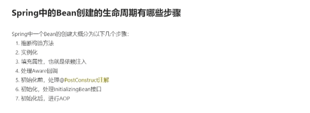

::: tip

单纯用来记录自己的东西。（只有我能懂）

:::

>TODO 数据库 中间件 算法 spring  

##  技能知识点（一些面试要求的技能知识点，杂乱无章）

- 1. Java基础扎实，了解JVM原理，熟悉IO
- 2. 熟悉主流开源应用框架，如SpringBoot、SpringMVC、Mybatis、SpringCloud等；
- 3. 熟悉关系型数据库MySQL、Oracle等，并有数据库以及**SQL优化**经验；
- 4. 熟悉分布式系统的设计和应用，熟悉各类**常用RPC、缓存、MQ等中间件**；

- 5、熟练掌握JAVA编程，熟悉SpringBoot，SpringMvc, Mybatis

- 6、熟悉Mysql、Redis, 熟悉ElastichSearch，Kafka, RabbitMQ

- 4、熟悉Http、Websocket通信，熟悉Rest和GraphQL协议

- （3）精通Java语言，了解JVM原理，有JVM性能调优经验尤佳；

- （4）精通主流开源框架，如SpringBoot、MyBatis、 SpringCloud、Dubbo等；

- （5）精通数据库设计和开发，熟练使用Mysql，良的SQL编写和优化能力，了解数据库原理，熟悉mysql锁机制、排它锁、间隙锁、死锁等问题；

- （6）掌握缓存、消息队列的原理、限制以及使用场景，熟练使用Redis，RabbitMq、RocketMQ、ZeroMQ其中之一;

- （7）熟悉网络编程，有MINA，Netty 其中之一的使用经验;

- （8）有服务器开发经验，对多线程，netty、异步编程熟悉；

- 1、精通 Java 开发语言，具有的面向对象的开发思想，熟悉多线程、网络通信开发；

- 2、熟练使用Java后台技术，熟悉Spring、SpringBoot、SpringCloud等常用开发框架；

- 3、熟悉 Redis, MySQL 等数据库操作，熟练使用SQL语言，有SQL优化的经验。

2.有5年及以上相关工作经验，拥有深度的计算机技术基础，具有良好的编码能力和编码风格，精通常用的数据结构与算法；

3.精通Java语言、JVM、多线程并发、网络IO、TCP协议栈，精通分布式、缓存、消息、MySQL等技术原理及细节；

4.关注新技术方向，习惯查阅和阅读英文资料，深究原理和细节，对各种工具和轮子都有自己的见解；

5.具备良好的学习能力、沟通能力，优秀的团队协作精神；乐于分享传播，善于培养团队成员。

3.3年以上Web后端开发经验，有负责过完整的系统设计和核心功能开发

4.熟悉SpringMVC/MyBatis/Maven/Git、Spring Boot等

5.熟悉Redis，RabbitMQ/Kafka，Zookeeper等底层中间件及分布式技术

6.有良好的编码规范、工程能力，具备良好的分析和解决问题能力

1、熟练掌握 Java  基础知识，有良好的编程习惯，具备良好的面向对象编程思想；
2、熟悉 Java  的集合框架，IO，如 HashMap， ArrayList等；
3、熟悉 JVM，GC  算法，常见的垃圾回收器，JVM性能调；
4、熟悉 Java  并发编程，如 volatile，CAS ，线程池等；
5、熟悉 Spring，SpringMVC，SpringBoot，SpringCloud；
6、熟悉 RocketMQ，MyBatis  等；
7、熟悉 MySQL，Redis，PostgreSQL；
8、熟悉常用算法和设计模式。

### 技能知识点进一步梳理 

1. 熟练掌握Java基础知识：比如集合框架，多线程编程、IO流、反射等。

2. 熟练掌握JVM原理和垃圾回收器：Java虚拟机内部结构、类加载机制、运行时数据区、垃圾回收算法、常用垃圾回收器（CMS、G1、ZGC等）的优缺点及调优方法等。

3. IO编程和网络通信：Java NIO. BIO、AIO编程模型、Socket网络编程、TCP/IP协议、HTTP通信协议等。

4. 开源框架：Spring Boot、Spring MVC、MyBatis、Spring Cloud、Dubbo等开源框架的使用和原理，如依赖注入、AOP、控制反转、ORM等。

5. 数据库设计和SQL优化：关系数据库的概念、ER图、范式化、索引设计原则、SQL语句的优化技巧、MySQL、PostgreSQL等数据库的使用和优化技巧。

6. 分布式系统的设计和应用：分布式系统的概念、CAP原理、分布式事务、负载均衡、高可用性、容错、分布式锁、分布式缓存等。

7. 常用中间件的原理和使用：RPC框架（Dubbo、gRPC）、缓存（Redis、Memcached）、消息队列（Kafka、RocketMQ）、分布式锁（Zookeeper）等。

8. Http、Websocket通信和协议：RESTful API设计原则、GraphQL的概念和使用、Websocket通信协议的实现方式及其应用场景等。

9. 了解Netty框架。

10. 数据结构和算法：基本数据结构（数组、链表、栈、队列、哈希表等）、常见算法（排序、查找、字符串匹配、动态规划等）的实现和应用。

11. 关注新技术方向：深入研究新兴技术领域，如区块链、AI、机器学习、大数据、云计算等，并积极尝试应用到实际项目中。

12. 学习能力、沟通能力、团队协作精神以及分享和培养能力：不断学习、探索新技术，具备良好的沟通与协作能力，善于分享所学知识，能够培养和指导团队成员。

13. 编码规范和工程能力，问题分析和解决能力：具有良好的代码规范和工程实践，能够快速定位和解决问题，以及进行系统性能优化。

### 梳理-自我对照

1. 熟练掌握 Java  基础知识，有良好的编程习惯，具备良好的面向对象编程思想；
2. 熟悉 Java  的集合框架，如 HashMap， ArrayList等，IO流、反射等；
3. 熟悉 JVM，GC  算法，如Java虚拟机内部结构、类加载机制、常见的垃圾回收器的优缺点及调优方法等；
4. 熟悉 Java 并发编程，如 JMM，volatile，CAS ，线程池等；
5. 熟悉 Spring，SpringMVC，SpringBoot，SpringCloud，MyBatis等开源框架的使用和原理，如依赖注入、AOP、控制反转等；
6. 熟悉常用中间件的原理和使用，如RocketMQ等。
7. 熟练掌握常用数据库 MySQL，Redis，PostgreSQL等的使用，SQL语句的优化技巧；
8. 熟悉常用的基本数据结构（数组、链表、栈、队列、哈希表等）、算法（排序、查找、字符串匹配、动态规划等）和设计模式（模板，策略，工厂）的实现和运用。
9. 不断学习、探索新技术，具备良好的沟通与协作能力，善于分享所学知识，能够培养和指导团队成员。
10. 具有良好的代码规范和工程实践，能够快速定位和解决问题，以及进行系统性能优化。

- 以下知识点待定，根据不同要求学习掌握
1. IO编程和网络通信：Java NIO、BIO、AIO编程模型、Socket网络编程、TCP/IP协议、HTTP通信协议等。 (暂时不要)
2. 数据库设计和SQL优化：关系数据库的概念、ER图、范式化、索引设计原则、SQL语句的优化技巧、MySQL、PostgreSQL等数据库的使用和优化技巧。（参考待定）
3. 分布式系统的设计和应用：分布式系统的概念、CAP原理、分布式事务、负载均衡、高可用性、容错、分布式锁、分布式缓存等。(暂时不要)
4. Netty框架，ElastichSearch，Dubbo
5. 熟悉网络编程，有MINA，Netty 其中之一的使用经验;
6. 熟悉常用中间件的原理和使用，RPC框架（Dubbo、gRPC）、缓存（Redis、Memcached）、消息队列（RocketMQ）、分布式锁（Zookeeper）等。

### 梳理-针对性知识点复习
::: tip
1. 熟练掌握 Java  基础知识，有良好的编程习惯，具备良好的面向对象编程思想；【Java面向对象，基础知识的梳理】
2. 熟悉 Java  的集合框架，如 HashMap， ArrayList等，IO流、反射等；【Java基础进阶】
3. 熟悉 JVM，GC  算法，如Java虚拟机内部结构、类加载机制、常见的垃圾回收器的优缺点及调优方法等；【JVM】
4. 熟悉 Java 并发编程，如 JMM，volatile，CAS ，线程池等；【并发编程】
5. 熟悉 Spring，SpringMVC，SpringBoot，SpringCloud，MyBatis等开源框架的使用和原理，如依赖注入、AOP、控制反转等；【框架原理以及对应知识点】
6. 熟悉常用中间件的原理和使用，如RocketMQ等。【原理和使用】
7. 熟练掌握常用数据库 MySQL，Redis，PostgreSQL等的使用，SQL语句的优化技巧；【数据库原理，MySQL索引，B+树，优化。Redis数据结构等】
8. 熟悉常用的基本数据结构（数组、链表、栈、队列、哈希表等）、算法（排序、查找、字符串匹配、动态规划等）和设计模式（模板，策略，工厂）的实现和运用。【算法，设计模式举例】
9. 不断学习、探索新技术，具备良好的沟通与协作能力，善于分享所学知识，能够培养和指导团队成员。
10. 具有良好的代码规范和工程实践，能够快速定位和解决问题，以及进行系统性能优化。【列举一个有意义的问题，（文书生成慢（线程池），自动重启（缓存））】

针对列举的知识点，复习相应的【】里面的内容，动态补充学习。
- 以下知识点根据要求针对性学习，掌握上面为主。
  1. IO编程和网络通信：Java NIO、BIO、AIO编程模型、Socket网络编程、TCP/IP协议、HTTP通信协议等。 (暂时不要)
  2. 数据库设计和SQL优化：关系数据库的概念、ER图、范式化、索引设计原则、SQL语句的优化技巧、MySQL、PostgreSQL等数据库的使用和优化技巧。（参考待定）
  3. 分布式系统的设计和应用：分布式系统的概念、CAP原理、分布式事务、负载均衡、高可用性、容错、分布式锁、分布式缓存等。(暂时不要)
  4. Netty框架，ElastichSearch，Dubbo
  5. 熟悉网络编程，有MINA，Netty 其中之一的使用经验;
  6. 熟悉常用中间件的原理和使用，RPC框架（Dubbo、gRPC）、缓存（Redis、Memcached）、消息队列（RocketMQ）、分布式锁（Zookeeper）等。
:::

### 终极

1. 熟练掌握 Java  基础知识，有良好的编程习惯，具备良好的面向对象编程思想；
2. 熟悉 Java 的集合框架、如 HashMap， ArrayList等，IO流、反射等；
3. 熟悉 JVM，GC 算法，如Java虚拟机内部结构、类加载机制、常见的垃圾回收器的优缺点及调优方法等；
4. 熟悉 Java 并发编程，如 JMM，volatile，CAS ，线程池等；
5. 熟悉 Spring，SpringMVC，SpringBoot，SpringCloud，MyBatis等开源框架的使用和原理，如依赖注入、AOP、控制反转等；
6. 熟悉常用中间件的原理和使用，如RocketMQ等。
7. 熟练掌握常用数据库 MySQL，PostgreSQL，Redis等的使用，SQL语句的优化技巧；
8. 熟悉常用的基本数据结构、算法和设计模式的实现和运用；
9. 不断学习，具备良好的沟通与协作能力，善于分享所学知识。具有良好的代码规范和工程实践，能够快速定位和解决问题，以及进行系统性能优化。

## 一些面试题

1、掘金：https://juejin.cn/post/6844904125709156359
2、我的PDF

## 一些视频学习教程
尚硅谷_SpringSecurity教程: http://www.atguigu.com/video/33/
netty： http://www.atguigu.com/video/56/
全套资料：https://shimo.im/docs/aBAYVEyDoBUbd13j/read
全套视频：http://www.atguigu.com/video/java/#step3

尚硅谷_Java面试真题50道：http://www.atguigu.com/video/245/

## 面试题集1
1、spring事务，隔离级别，传播行为，spring循环依赖

2、HTTPS和http
HTTP（Hypertext Transfer Protocol）和HTTPS（HTTP Secure）都是互联网中的协议，都是用来处理Web请求和响应。

HTTP是一种无状态协议，它使用明文传输，在网络传输过程中数据很容易被截获，因此安全性较低。HTTPS是在HTTP之上的安全协议，它使用`SSL / TLS`来对传输数据进行加密，从而提供更高的安全性。

在HTTP和HTTPS之间，有以下的主要区别：

安全性：HTTP使用明文传输，数据很容易被截获和篡改，HTTPS在传输的过程中使用加密的方式，防止这种情况发生，因此安全性更高。

传输速度：HTTPS加密过程需要计算资源，传输速度相对于HTTP会较慢，在一些对速度要求比较高的场景下，可能无法满足。

传输方式：HTTP的URL以“http://”开头，HTTPS的URL以“https://”开头，HTTPS使用的默认端口是443，而HTTP使用的默认端口是80。因此，在传输方式上会有一些区别。

证书验证：HTTPS通过SSL / TLS协议进行加密，客户端和服务器之间交换的信息是通过**证书**确认身份的。服务器需要拥有一个证书，证书需要由可信的第三方机构颁发，这样客户端才能认为该服务器是可信的。

综上所述，在传输安全性要求比较高的情况下，应该选择使用HTTPS协议；在一些对速度要求比较高、数据相对较为简单的情况下，可以使用HTTP协议。

3、hashmap，hashmap链表转化红黑树

JDK1.8 之后在解决哈希冲突时有了较大的变化，当链表长度大于阈值（默认为 8）
（将链表转换成红黑树前会判断，如果当前数组的长度小于 64，那么会选择先进行数组扩容，而不是转换为红黑树）时，
将链表转化为红黑树，以减少搜索时间。

ConcurrentHashMap 取消了 Segment 分段锁，采用 Node + CAS + synchronized 来保证并发安全。
数据结构跟 HashMap 1.8 的结构类似，数组+链表/红黑二叉树。
Java 8 在链表长度超过一定阈值（8）时将链表（寻址时间复杂度为 O(N)）转换为红黑树（寻址时间复杂度为 O(log(N))）。
Java 8 中，锁粒度更细，synchronized 只锁定当前链表或红黑二叉树的首节点，这样只要 hash 不冲突，就不会产生并发，就不会影响其他 Node 的读写，效率大幅提升。

4、项目中使用了那些锁

5、接口抽象类区别

1、从概念上来说，抽象类主要用于代码的复用，情敌啊

6、多态的理解
表示一个对象具有多种的状态，具体表现为父类的引用指向子类的实例。

7、类加载和JVM垃圾回收算法

8、多线程的几个创建方式
9、wait和sleep的区别

在Java中，wait和sleep都是用于线程同步和调度的关键字，二者有一些不同点：

wait()是Object类的方法，sleep()是Thread类的静态方法，在使用时需要注意区别。

wait()会释放对象的锁，进入等待状态，直到其他线程调用了该对象的notify()或notifyAll() 方法来唤醒它，而sleep()方法则不会释放锁，线程仍然持有对象的锁，继续执行其他任务。

wait()只能在synchronized中使用，在进入 synchronized 代码块后，线程发现条件不满足，调用wait()方法释放对象锁并进入等待状态，直到其他线程通知它。sleep()可以在任何地方使用，不需要在 synchronized 中。

wait()和notify()、notifyAll()一起使用的时候，必须放在synchronized语句块中使用；而sleep()可以在任何地方使用。

综上所述，wait()和sleep()方法都可以暂停线程的执行，但二者的根本区别在于wait()会释放对象锁并进入

10、分布式锁的使用场景
11、spring bean生命周期

12、问题排查

[问题排查](../学习笔记/大厂面试第二季/13_Linux相关命令/README.md) 

1、先排查服务器整体使用情况  top   CPU（CPU：vmstat） 网路等
2、定位到我们运行的进程  jsp
3、

结合Linux 和 JDK命令一起分析，步骤如下

- 1、使用top命令找出CPU占比最高的

- 2、ps -ef 或者 jps -l 进一步定位，得知是一个怎么样的后台程序出的问题

- 3、`定位到具体线程或者代码`

  - ps -mp 【进程编号】  -o THREAD,tid,time
  - 例如： ps -mp 2597733 -o THREAD,tid,time
  - 参数解释
    - -m：显示所有的线程
    - -p：pid进程使用CPU的时间
    - -o：该参数后是用户自定义格式

- 4、将需要的`线程ID`转换为16进制格式（英文小写格式），16进制可以用电脑计算器换算。

  - printf “%x\n” 有问题的线程ID

- 5、jstack 【进程ID】 | grep 【tid（16进制线程ID小写英文）】 -A60

  精准定位到错误的地方，代码行数。

