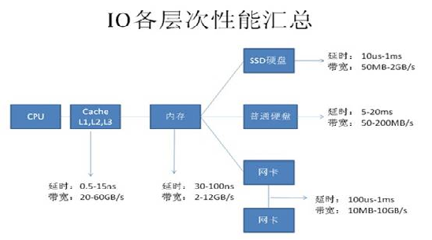
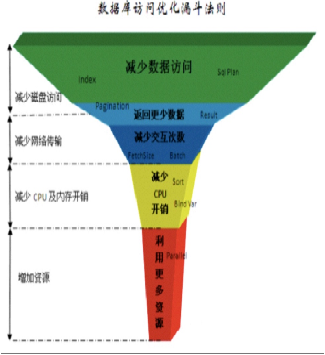

---
title: 据库优化
date: 2023-05-10
tags:
- 据库优化
- SQL优化
---

## 1、为什么做了性能测试现场还是出现性能问题？

可能的一些原因：

- 性能测试的重点不在出现性能的模块

- 硬件配置低，磁盘io，内存大小，网络
- 数据量增长不符合预期，增长太快，或者脏数据
- 数据库统计信息或者索引未更新
- 频繁的定时任务
- 业务系统新需求，需求变更等等

## 2、项目中T主要问题：

- 1、接近一半的SQL慢是因为磁盘io读取耗时导致，建议更换iops更高的ssd或者增加内存缓解

- 2、部分SQL没有走正确的索引，通过调整sql，创建索引优化

- 3、部分SQL由于过滤条件不好，和大表关联导致执行慢，如t_sscyr表没有过滤条件，实际上其他表传了c_bh_aj

- 4、主外键类型不一致导致不能走索引（t3e中使用了部分t3e的表，进行关联时类型不一致），t_sscyr表的主键是varchar32和其他表的关联键char32类型不一致

- 5、网络查控脏数据，2个月生成2亿数据，大量的插入，查询导致耗费大量资源
- 6、定时任务执行频繁，每小时跑一次

> 优化后：数据库整体稳定，负载，cpu不高，抽数任务由原来的的一小时跑一次调整为上午11点跑一次，下午四点钟跑一次，跑数期间cpu30%，不跑数cpu在10%左右

## 3、设计层面应该遵循的数据库设计规范

## 4、工作中该如何优化？

> 理论 + 实践

### 4.1 需要掌握的东西

1. 数据调优理论
2. 常规的调优方法

### 4.2 数据调优理论
> 调优到底调什么？调哪里？ 其实大部分数据库操作 90% 以上的时间都花在了 IO 读写上。

方法： 增加资源优化成本高，且提升效果低。 而减少数据访问优化成本低，性能提升明显。如下图：

### 4.3 优化方法

### 优化方法
- 减少磁盘访问
    - **索引**
    - 返回更少的数据

- 减少网络传输
  - 一次返回少量数据，分页
  - select *
  - 批量提交

- 减少cpu以及内存开销
  - 复杂的计算
  - order by  group by  distinct

- 利用更多资源
  - 客户端，服务端并行
  - RAID 磁盘阵列

### 优化层面

- 物理层
  - RAID 磁盘阵列
  - HA 集群、负载均衡

- 逻辑层
  - 理论
  - 参数
  - 索引
  - 冗余
  - 分区表
  - 临时表

